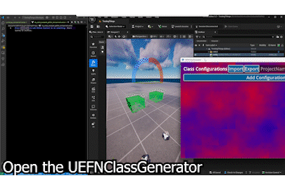
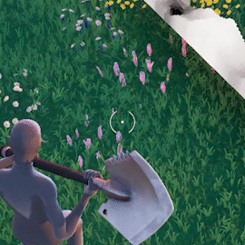
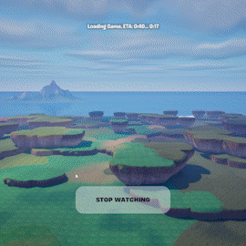
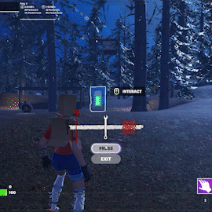
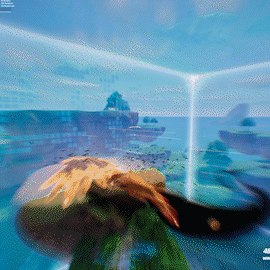
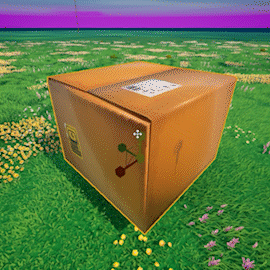

# ZeroYaHero's Portfolio
*GitHub repositories are featured, but if you want to look at public code only that is the most up to date just [look at my GitHub profile.](https://github.com/ZeroYaHero) PS: some of the code featured here does not have a repository and instead is a gist so it might be easier to find.*

This portfolio is an aggregation of my proudest, underapprecieated, or elusive work.

## Class Generator

GUI that generates Verse code and UEFN devices given a set of configurations that need to be combined using cartesian product. Tool created and used for commission. [GitHub](https://github.com/ZeroYaHero/UEFNClassGenerator)

## VerseNoise

Custom Noise program in UE/UEFN Verse inspired by Perlin Noise and Fractal Brownian Motion. At the time of writing this program, there was no bitwise operators (and at the time of me writing this 10/5/2025 there still isn't). This made it a little bit of challenge to stay somewhat performant.
[Gist](https://gist.github.com/ZeroYaHero/63499397e40025fe061cd8c3d7f55397)
[Video](https://x.com/ZeroYaHero/status/1765820934768771317)
## Procedural Environment Demo

Fully procedural terrain generation system using VerseNoise, Voronoi diagrams, and spatial hashing. [Video](https://x.com/ZeroYaHero/status/1816518781092659348)
## "Dead by Daylight" Inspired QTE/Skill Check

Hand drawn assets in Procreate. Scripted in Verse. [Video](https://x.com/ZeroYaHero/status/1735732924182327667)
## Fortnite Storm Shader Recreation

Recreation of the "Storm" shader seen in Fortnite using Unreal Engine Material Editor. No peeking! [Video](https://x.com/ZeroYaHero/status/1687967828215754753)
## Storm Box
PvP game within Fortnite/UEFN. Uses the recreated Fortnite Storm Shader and Procedural Environment system mentioned before.

[GitHub](https://github.com/ZeroYaHero/StormBox)

[Thumbnail/Logo Design in Adobe Illustrator and Render done in Blender](https://x.com/ZeroYaHero/status/1820099148542034383)

[Scrapped Promotional Volumetric Animation done in Blender](https://x.com/ZeroYaHero/status/1695507653219504340)
## FNGameplay: UEFN Verse Gameplay Framework (WIP)
Includes many classes and methods that abstract: state machine, persistence, teams, combat events, and more. [Gist](https://gist.github.com/ZeroYaHero/d0f17197e4f0a5a72bc1bf53e28c9860)
## VerseTriggerVolumes: OOP Excercise
Commission for another UEFN creator. OOP is not my forte and as I learn the more I prefer ECS. However, for this project I wanted to push it to the limits. Abstracts trigger volumes by allowing the user to select positions or source entities/actors transforms. [GitHub](https://github.com/ZeroYaHero/VerseVolumes)
## Burning Cardboard Box Vertex Shader

[Video](https://x.com/ZeroYaHero/status/1913019372379025675)
## Adobe Substance Designer: Sparkling Item Texture Utility
Highlights the provided texture and adds sparkling and holographic effects. [Video](https://x.com/ZeroYaHero/status/1822694817567998083)
## Adobe Substance Designer: Sci-Fi Cube Study
Just felt like learning Substance Designer for assets by mimicing one I saw on art-station. [Video](https://x.com/ZeroYaHero/status/1819143137819820472)
## Like & Favorite Creator Shader:
Material done in UE with no flipbooks and a "keyframe" like setup. Vector art created in Adobe Illustrator. [Video](https://x.com/ZeroYaHero/status/1811214016997454189)

### 3/9/25
[Reload Realistics: Gamemode inspired by Epic Games Fortnite Reload mode. Custom HUD/UI animated and programmed.](https://x.com/ZeroYaHero/status/1898818115091538321)
### 1/15/24
[Godot Explorations: Tested/designed sprite textures, player components, particle components, and tweens!](https://x.com/ZeroYaHero/status/1747096356622139514)
